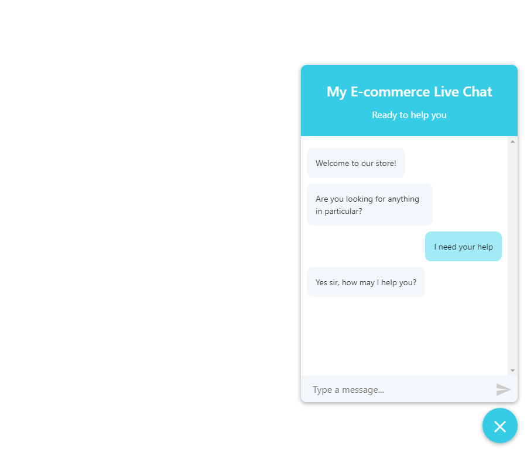
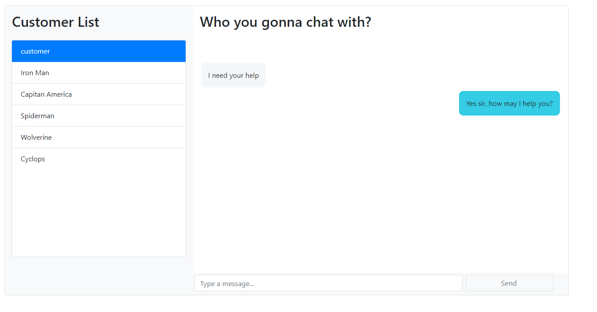

# Build a Customer Support Live Chat Widget with React

This example shows how to build a React chat widget using CometChat Pro SDK and API. 

SCREENSHOTS

Jump straight into the code or read the accompanying step-by-step guide here on our blog.

## Technology
This demo uses:

* [CometChat Pro JavaScript SDK](https://github.com/cometchat-pro/javascript-chat-sdk)
* React
* Express

## Running the demo locally
* Download the repository [here](https://github.com/cometchat-pro/javascript-reactjs-chat-app.git) or by running `git clone https://github.com/cometchat-pro/javascript-reactjs-chat-app.git`
* run `npm install` on both root directory and `client/`
* You need to sign up for CometChat PRO and create your application first
* Then put your AppID and ApiKey into `server.js` line 6-7
* Also put your AppID and ApiKey into `client/config.js`
* run `npm install` on both root directory and `client/`
* In root folder, run `npm run start`, then on another bash terminal, navigate to `client` directory and run `npm run start`
* A browser will open `localhost:3000`

## Useful links

* [📚Tutorial](https://prodocs.cometchat.com/docs)

## Other examples

* [ReactJS Chat app](https://github.com/cometchat-pro/javascript-reactjs-chat-app)
